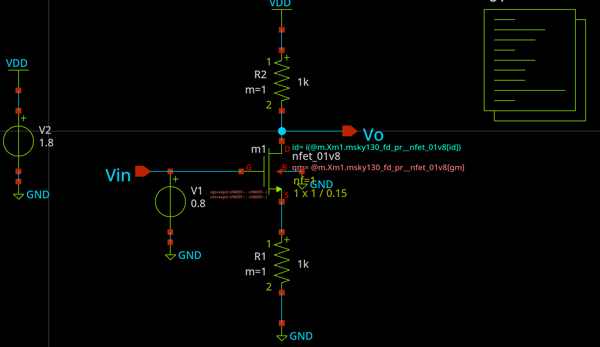

#XSCHEM PROJECT INITIALIZATION


# DO NOT RUN THE COMMANDS BLINDLY
## 1. Project Initialization Steps
### Step 1: Copy Local `xschemrc`
```
cd /path/to/your/project_directory
cp $PDK_ROOT/sky130A/libs.tech/xschem/xschemrc .
```
### Step 2: Fix Relative Symbol Paths in Schematics
```
sed -i 's|sky130_tests/sky130_fd_pr/|sky130_fd_pr/|g' *.sch
sed -i 's|sky130_tests/devices/|devices/|g' *.sch
sed -i 's|sky130_tests/||g' *.sch
```
### Step 3: Launch Xschem
`xschem your_design.sch &`


| [](SINGLE_STAGE_AMP/CS_RES/) <br> **CS Resistor Load** | [](SINGLE_STAGE_AMP/CS_DIODE/) <br> **DIODE CONNECTED Amplifier** |
| :---: | :---: |
| [](SINGLE_STAGE_AMP/SOURCE_FOLLOWER/) <br> **Source Follower** | [](SINGLE_STAGE_AMP/CS_DEGENERATION) <br> **SOURCE DEGENERATION** |
